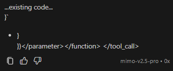
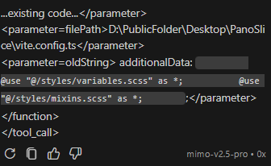
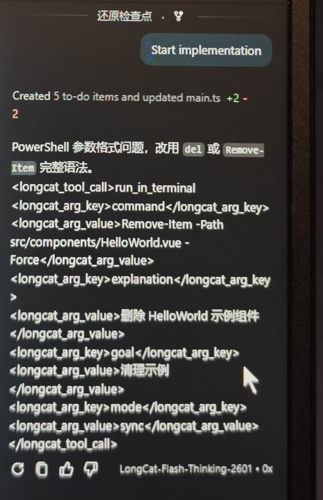

# 模型适配问题报告

> 本文档记录各模型在 Copilot 代理服务中的适配情况、已知问题及排查结论。

---

## Xiaomi MiMo V2.5 Pro — 缺陷问题报告

### 概述

Xiaomi MiMo V2.5 Pro 在 Copilot 工具调用场景下表现出严重的结构化输出缺陷，经过多轮修复尝试后仍无法可靠工作。结论：**该模型不适合在 Copilot 中作为工具调用模型使用**。

### 问题清单

#### 1. XML 工具调用格式错误（核心问题）

MiMo 在需要调用工具时，倾向于输出残缺的 XML 格式而非标准的 JSON `tool_calls`。

**错误示例（实际输出）：**
```xml
...existing code...</parameter>
<parameter=filePath>D:\...\vite.config.ts</parameter>
<parameter=oldString> additionalData: ...</parameter>
</function>
</tool_call>
```



**问题细节：**
- 使用 `<parameter=name>` 而非标准 XML 的 `<parameter name="name">`
- 缺少 `<tool_calls>` 外层包裹
- 缺少 `<function name="...">` 函数名声明
- 泄漏系统提示词中的占位符 `...existing code...`
- 标签前后出现多余空格

#### 2. 输出字段不稳定

XML 标签可能出现在不同字段中，无固定规律：

| 场景 | 字段 | 示例 |
|------|------|------|
| 场景 A | `reasoning_content` | `<parameter=oldString>...</parameter>` |
| 场景 B | `content` | `</parameter>\n</function>\n</tool_call>` |
| 正常 JSON | `tool_calls` | 标准 `{"function": {"name": "...", "arguments": "..."}}` |

三种输出模式随机出现，无法通过单一检测策略覆盖。



#### 3. 系统提示词干预无效

向请求中注入明确的格式约束（禁止 XML、要求 JSON、给出正例）后，MiMo 仍然输出错误的 XML 格式。说明该模型**不具备遵循细粒度格式指令的能力**。

#### 4. 字符串替换场景高频触发

XML 格式错误在 `replace_string_in_file` 场景下出现频率最高，参数中频繁出现 `oldString`/`newString`。其他工具调用（`read_file`、`run_in_terminal`）偶尔也会受影响，但概率较低。

### 修复尝试记录

| 方案 | 描述 | 结果 |
|------|------|------|
| XML → JSON 转换 | 检测 `<tool_call>` 开标签，拦截 reasoning 流，解析参数后构造 JSON tool_calls | 部分有效，但 MiMo 输出字段不稳定导致漏检 |
| System prompt 约束 | 注入英文格式指令，禁止 XML、要求 JSON | 无效，模型不遵循指令 |
| `newString>`/`oldString>` 精确拦截 | 仅针对字符串替换场景做关键字检测 + 参数提取 | 因输出字段不稳定（content vs reasoning_content）导致漏检 |
| 同时检测 `content` + `reasoning_content` | 扩展检测范围覆盖所有字段 | 父类钩子调用条件限制导致拦截时机错过 |

### 根因分析

MiMo V2.5 Pro 的核心问题在于：

1. **结构化输出能力不足** — 无法稳定生成符合 OpenAI 规范的 `tool_calls` JSON
2. **指令遵循能力弱** — 即使 system prompt 中明确禁止 XML，仍输出 XML
3. **行为不可预测** — 同一场景下输出格式随机变化，无法建立稳定的检测/转换规则
4. **系统提示词泄漏** — 将 Agent 指令中的占位符 `...existing code...` 混入输出

这些问题属于**模型本身的质量缺陷**，无法通过代理层的补丁修复。

### 建议

- **不推荐** 将 MiMo V2.5 Pro 用于需要工具调用的 Copilot 场景
- **可考虑** 仅用于纯对话场景（无需工具调用），此时文本生成质量尚可
- **替代方案**：DeepSeek、LongCat 等模型在工具调用方面表现更稳定

---

## DeepSeek — 兼容适配

### 已知问题

#### 1. 多轮工具调用需 `reasoning_content`

DeepSeek 在收到包含 `tool_calls` 的 assistant 消息时，要求同一消息中必须包含 `reasoning_content` 字段，否则返回 400 错误。

**解决方案：** 已在代理层实现 `reasoning_content` 缓存机制：
- 首次工具调用时捕获 `reasoning_content` 存入 SQLite 数据库
- 后续请求中根据 `tool_call_id` 回填缓存的思考内容
- 缓存未命中时使用空字符串 `""` 作为 fallback

#### 2. 思考链较长

DeepSeek 的 `reasoning_content` 可能很长（数千 token），会增加请求体大小和延迟。

---

## LongCat — 兼容适配

### 已知问题

#### 1. LongCat-Flash-Thinking-2601 工具调用不稳定

`LongCat-Flash-Thinking-2601` 在工具调用场景下偶尔出现输出格式异常，表现为 longcat_tool_calls 参数结构不完整或缺失必要字段，导致 Copilot 无法正确解析。



**建议：** 优先使用 `LongCat-2.0-Preview`，该模型在工具调用方面表现稳定。

