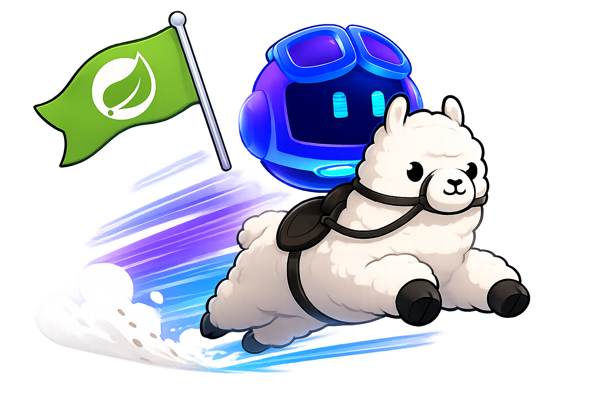

<p align="center">
  
</p>

<h1 align="center">Copilot Ollama SpringBoot Proxy (COSP)</h1>

<p align="center">
  <a href="LICENSE"></a>
</p>

<p align="center">
  为 GitHub Copilot 提供 Ollama 模型发现与 OpenAI 聊天转发的本地代理。
</p>

## 概述

COSP 是 Spring Boot WebFlux 服务。Copilot 通过 Ollama 发现接口读取模型，而聊天请求通过 OpenAI 兼容接口转发至已配置的上游服务。

所有供应商都是数据库中的普通配置，不存在内置或专有供应商实现。管理后台可新增供应商、配置 API Key、Base URL、模型、能力和请求转换规则。

## 请求流程

```text
GET  /api/version
GET  /api/tags
POST /api/show
POST /v1/chat/completions
POST /v1/messages
```

- `/api/version`、`/api/tags`、`/api/show` 仅用于 Ollama 模型发现。
- `/v1/chat/completions` 执行实际聊天，支持 SSE 与非流式响应。
- `/v1/messages` 是 Anthropic Messages 协议入口，供 Claude 系客户端直连；Copilot 不走这条。
- 模型可使用 `[provider-key] model-name` 显式路由；未加前缀的模型只有在全部启用供应商中唯一匹配时才会路由。

## 技术栈

- Java 21、Spring Boot 3.5、WebFlux/Reactor
- Spring Security JWT、SQLite/JDBC/Hikari
- Vue 3、TypeScript、Vite、Naive UI、Pinia
- Maven 负责后端及前端集成构建

## 快速开始

环境要求：Java 21。

```bash
./mvnw spring-boot:run
```

服务默认监听 `http://localhost:11434`，同一端口提供 API 与 Vue 管理后台。默认账号为 `root/root`。

在后台新增一个供应商后，填写其 OpenAI 兼容 Base URL、API Key 和模型配置。模型能力由数据库中的 `caps_tools`、`caps_vision` 决定；上下文窗口应不低于 8192。

## 配置

```yaml
server:
  port: ${SERVER_PORT:11434}
spring:
  datasource:
    url: ${SQLITE_URL:jdbc:sqlite:./admin.db}
```

服务商运行时配置保存在 SQLite：

| 表 | 用途 |
|---|---|
| `provider_config` | 供应商键、显示名、启用状态与 Base URL |
| `provider_api_key` | 加密的 API Key 列表与激活项 |
| `provider_model` | 模型、上下文、输出上限及能力声明 |
| `provider_request_transform` | 自定义请求头与请求体规则组 |
| `app_config` | 伪造版本号等应用配置 |

请求体规则按**规则组**组织：每组声明适用的线路协议（OpenAI / Anthropic）、自带一份调试样本，
组内规则可按顺序修改、删除字段或递归调整对象与数组中的消息内容。

## API

| 方法 | 路径 | 用途 |
|---|---|---|
| `GET` | `/api/version` | 返回 Ollama 版本 |
| `GET` | `/api/tags` | 返回可用模型 |
| `POST` | `/api/show` | 返回模型能力和上下文窗口 |
| `POST` | `/v1/chat/completions` | 执行聊天补全（OpenAI 协议） |
| `GET` | `/v1/models` | 返回 OpenAI 格式模型列表 |
| `POST` | `/v1/messages` | 执行聊天补全（Anthropic 协议） |

## 开发与测试

```bash
./mvnw test
./mvnw clean package -DskipTests
cd frontend && npm run build
```

不要在代码中硬编码供应商、模型能力或 API 格式。标准 OpenAI 兼容服务应通过管理后台配置；复杂协议适配应先确认确实无法用请求转换规则表达。

## 许可证

GPL-3.0，详见 [LICENSE](LICENSE)。
